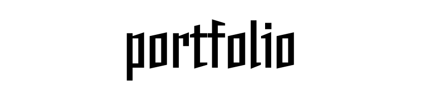

 

<h1 align="center">Hasher Amin</h1>

<h3 align="center">
Developer • Designer • Curious Builder
</h3>

Passionate about creating clean software, intelligent solutions, and beautiful user experiences.

## About Me

- I'm a Developer and Designer from **Earth**.
- I mainly work with **Python** and enjoy building useful software.
- I'm exploring **Artificial Intelligence**, **Computer Vision**, and **Automation**.
- I love learning new technologies and turning ideas into real-world projects.
- I'm always learning and improving with every project I build.

## Connect With Me

 

## Languages & Tools

 

### Code. Design. Create.

## Contribution Snake

