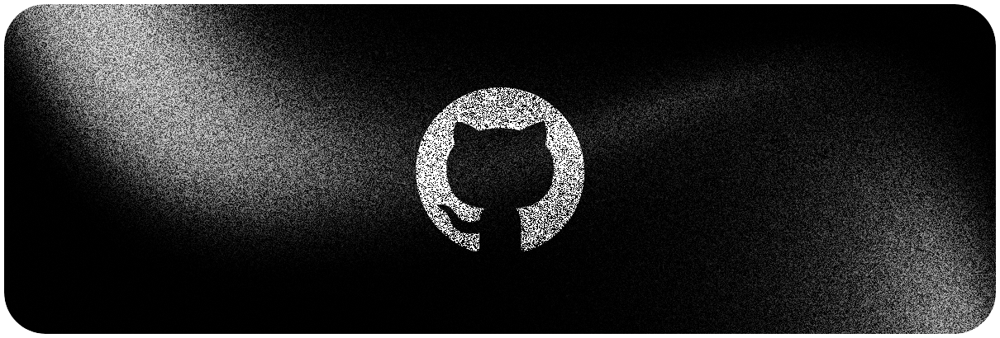
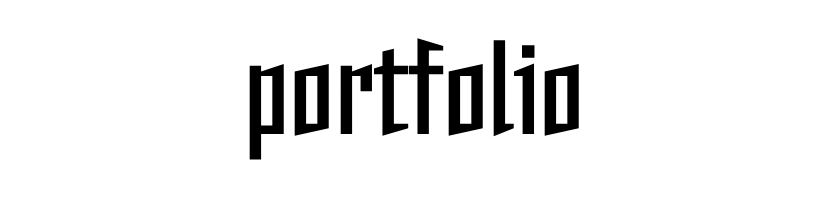

<div align="center">



<!--  -->

<br><br>


<hr>


<!-- <p>Passionate about creating clean software, intelligent solutions, and beautiful user experiences.</p> -->

</div>

<hr>

## About Me

- **System Localization:**

  ```json
  {
    "galaxy": "Milky Way (Orion Arm / ~27k ly from Center)",
    "system": "Solar System (Sol-3)",
    "planetary_body": "Earth (Geoid / 1.0 AU)",
    "hemisphere": "Northern-Eastern",
    "coordinates": "30.3753° N, 69.3451° E (Pakistan)"
  }
  ```

- **Primary Fuel:** Converts caffeine and **Python** code into fully functional, useful software.
- **Current Obsession:** Diving deep into **Artificial Intelligence**, teaching machines how to see (**Computer Vision**), and making scripts do my chores (**Automation**).
- **Mission:** Obsessed with learning bleeding-edge tech and turning chaotic midnight ideas into real-world projects.
- **Evolution:** Currently operating on a continuous loop of building, breaking, learning, and upgrading.


<hr>

## Let's Connect

<div align="center">

<a href="mailto:hasheramin5@gmail.com">
  
</a>
<a href="https://www.linkedin.com/in/hasheramin">
  
</a>
<a href="https://www.instagram.com/de_hasheramin">
  
</a>
<a href="https://twitter.com/hasheramin_code">
  
</a>
<a href="https://www.youtube.com/@de_hasheramin">
  
</a>

<br>

<a href="https://hasheramin5-cyber.github.io/">
  
</a>

</div>

<hr>

## Languages & Tools

<div align="center">


</div>
